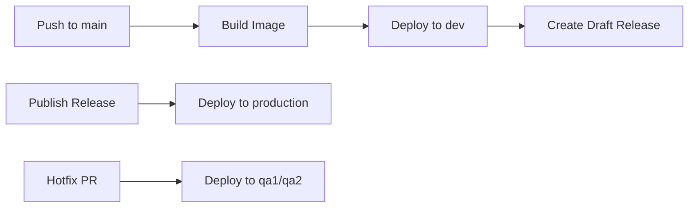

<!-- markdownlint-disable -->
# example-app-on-ecs <a href="https://cpco.io/homepage?utm_source=github&utm_medium=readme&utm_campaign=cloudposse/example-app-on-ecs&utm_content="></a>
<a href="https://github.com/cloudposse/example-app-on-ecs/releases/latest"></a><a href="https://slack.cloudposse.com"></a>
<!-- markdownlint-restore -->

<!--


  ** DO NOT EDIT THIS FILE
  **
  ** This file was automatically generated by the `cloudposse/build-harness`.
  ** 1) Make all changes to `README.yaml`
  ** 2) Run `make init` (you only need to do this once)
  ** 3) Run`make readme` to rebuild this file.
  **
  ** (We maintain HUNDREDS of open source projects. This is how we maintain our sanity.)
  **


-->

Example Dockerized application deployed on ECS.


## Introduction

* [Docker](https://docs.docker.com/engine/reference/builder/) for developing, shipping, and running,
* [ECR](https://aws.amazon.com/ecr/) to store the Docker images
* [ECS](https://aws.amazon.com/ecs/) as the container orchestration platform


## Usage

# Apps on ECS - Deployment System

A comprehensive ECS deployment system using GitHub Actions, Ecspresso, and Terraform for automated application deployment across multiple environments.

## Architecture Overview

This system provides a complete CI/CD pipeline for deploying containerized applications to Amazon ECS using:

- **GitHub Actions**: Automated workflows for building, testing, and deploying applications
- **Ecspresso**: ECS deployment tool
- **Terraform/Atmos**: Infrastructure as Code for ECS services and supporting resources

## Repository Structure

Please note the examples here can be named anything, they just would need to be configured differently.

```
├── app-on-ecs/                    # Sample application
│   ├── .github/workflows/         # GitHub Actions workflows
│   └── deploy/taskdef.json        # Partial task definition template
├── infra-config/                  # Infrastructure configuration
│   └── .github/environments/      # Environment-specific configurations
└── infrastructure/                # Live infrastructure definitions
    └── stacks/                    # Terraform/Atmos stack configurations
```

### Workflows Layout

We've consolidated all the workflows, including the shared/reusable GitHub reusable workflows. We've done this to make it easier for Developers to understand how the example leverages all the workflows.  In practice, we recommend moving the reusable workflows into a centralized repository, where they can be shared by other application repositories. For example, from this example, we would recommend moving all the `ecspresso-*` and all `workflow-*` workflow files to a centralized repository (e.g. a repository named `github-action-workflows`). The best solution will depend on your GitHub organization structure and team size. Pick what works for you and your team.

When your workflows are consolidated, you will need only 3 inside this repository:

1. feature-branch.yml
2. main-branch.yml
3. release.yml

The remaining workflows are the reusable/shared implementation. This approach makes it easier to define a standardized CI/CD interface for all of your services.

```console
.github
├── configs/
│ ├── draft-release.yml
│ └── environment.yaml
└── workflows/
  ├── ecspresso-feature-branch.yml
  ├── ecspresso-hotfix-branch.yml
  ├── ecspresso-hotfix-mixin.yml
  ├── ecspresso-hotfix-release.yml
  ├── ecspresso-main-branch.yml
  ├── ecspresso-release.yml
  ├── feature-branch.yml
  ├── main-branch.yaml
  ├── release.yaml
  ├── workflow-cd-ecspresso.yml
  ├── workflow-cd-preview-ecspresso.yml
  ├── workflow-ci-dockerized-app-build.yml
  ├── workflow-ci-dockerized-app-promote.yml
  ├── workflow-controller-draft-release.yml
  ├── workflow-controller-hotfix-reintegrate.yml
  ├── workflow-controller-hotfix-release-branch.yml
  └── workflow-controller-hotfix-release.yml
```

## Workflow System

### Deployment Workflows

The system includes three main deployment workflows:

#### 1. Main Branch Workflow (`main-branch.yaml`)

- **Trigger**: Push to `main` branch
- **Environment**: `dev`
- **Actions**:
  - Build and test Docker image
  - Deploy to `dev` environment
  - Create **draft** release

#### 2. Release Workflow (`release.yaml`)

- **Trigger**: Published GitHub release
- **Environment**: `staging` & `production`
- **Actions**:
  - Promote (tag) release commit sha Docker tag to release version
  - Deploy tagged version to `staging` & `production`
  - Use release tag as image version

#### 3. Hotfix Branch Workflow (`hotfix-branch.yaml`)

- **Trigger**: Pull requests to `release/**` branches
- **Environment**: `qa1` or `qa2` (based on labels)
- **Actions**:
  - Deploy to QA environments for testing
  - Support rollback on failure

### Workflow Configuration

All workflows use the `use-partial-taskdefinition: true` parameter, enabling the partial task definition deployment approach.

## Partial Task Definitions

### What are Partial Task Definitions?

Partial task definitions are minimal JSON templates that contain only the essential container configuration needed for deployment. Instead of maintaining complete ECS task definitions, you define only the core container properties. This allows the app developers to configure environment variables, task settings (such as memory and CPU usage), and other configuration within the app repository.

### Example Partial Task Definition

The minimum required setup is to have the image defined by the environment variable `IMAGE`, which is set by GitHub Actions.

`deploy/taskdef.json`:

```json
{
  "containerDefinitions": [
    {
      "name": "app",
      "image": "{{ must_env `IMAGE` }}"
    }
  ]
}
```

### How Partial Task Definitions Work

1. **Template Processing**: Ecspresso processes the partial task definition template
2. **Environment Variable Substitution**: Variables like ```{{ must_env `IMAGE` }}``` are replaced with actual values
3. **Infrastructure Integration**: The ECS service configuration from Terraform provides:
  - Task CPU and memory settings
  - Network configuration
  - IAM roles
  - Load balancer settings
  - Environment variables

### Benefits

- **Simplified Maintenance**: The app developers can configure environment variables, and other settings, while things like volume mounts, security groups, and other infrastructure settings are managed by Terraform.
- **Infrastructure Separation**: Infrastructure settings managed via Terraform
- **Consistency**: Standardized deployment patterns across applications

## Environments Configuration

In your application repository, you define the action location for environments. In this example application `.github/configs/environment.yaml` is used.

```yaml
# assumes the same organization
environment-info-org: cloudposse
environment-info-repo: infra-config
implementation_path: .github/environments
implementation_file: ecspresso.yml
implementation_ref: main
```

This tells GitHub Actions where to find the environment configuration action.

Then the `infra-config/.github/environments/ecspresso.yml` file defines environment-specific settings as a composite action.

<details>
<summary>Show file contents</summary>

```yaml
name: "Environments"
description: "Get information about cluster"
inputs:
  environment:
    description: "Environment name"
    required: true
  namespace:
    description: "Namespace name"
    required: true
  repository:
    description: "Repository name"
    required: false
  application:
    description: "Application name"
    required: false
  attributes:
    description: "Comma separated attributes"
    required: false
outputs:
  name:
    description: "Environment name"
    value: ${{ steps.result.outputs.name }}
  region:
    description: "AWS Region"
    value: ${{ steps.result.outputs.region }}
  role:
    description: "IAM Role"
    value: ${{ steps.result.outputs.role }}
  cluster:
    description: "Cluster"
    value: ${{ steps.result.outputs.cluster }}
  namespace:
    description: "Namespace"
    value: ${{ steps.result.outputs.namespace }}
  ssm-path:
    description: "SSM path"
    value: ${{ steps.result.outputs.ssm-path }}
  s3-bucket:
    description: "S3 Bucket name"
    value: ${{ steps.result.outputs.s3-bucket }}
  account-id:
    description: "AWS account id"
    value: ${{ steps.result.outputs.aws-account-id }}
  stage:
    description: "Stage name"
    value: ${{ steps.result.outputs.stage }}
runs:
  using: "composite"
  steps:
    - uses: cloudposse/github-action-aws-region-reduction-map@0.2.1
      id: region
      with:
        region: us-east-2
        format: "fixed"

    - uses: cloudposse/github-action-yaml-config-query@0.1.3
      id: name
      with:
        query: .${{ inputs.application == '' }}
        config: |
          true:
            name: ${{ inputs.repository }}
          false:
            name: ${{ inputs.application }}

    - uses: cloudposse/github-action-yaml-config-query@0.1.0
      id: result
      with:
        query: .${{ inputs.environment }}
        config: |
          qa1:
            cluster: acme-plat-${{ steps.region.outputs.result }}-sandbox-ecs-platform
            name: acme-plat-${{ steps.region.outputs.result }}-sandbox-${{ steps.name.outputs.name }}-qa1
            role: arn:aws:iam::QA_ACCOUNT_ID:role/acme-plat-${{ steps.region.outputs.result }}-sandbox-${{ steps.name.outputs.name }}-qa1
            ssm-path: /ecs-service/${{ steps.name.outputs.name }}/url/0
            s3-bucket: acme-plat-${{ steps.region.outputs.result }}-sandbox-ecs-tasks-mirror
            region: us-east-2
          qa2:
            cluster: acme-plat-${{ steps.region.outputs.result }}-sandbox-ecs-platform
            name: acme-plat-${{ steps.region.outputs.result }}-sandbox-${{ steps.name.outputs.name }}-qa2
            role: arn:aws:iam::QA_ACCOUNT_ID:role/acme-plat-${{ steps.region.outputs.result }}-sandbox-${{ steps.name.outputs.name }}-qa2
            ssm-path: /ecs-service/${{ steps.name.outputs.name }}/url/0
            s3-bucket: acme-plat-${{ steps.region.outputs.result }}-sandbox-ecs-tasks-mirror
            region: us-east-2
          dev:
            cluster: acme-plat-${{ steps.region.outputs.result }}-dev-ecs-platform
            name: acme-plat-${{ steps.region.outputs.result }}-dev-${{ steps.name.outputs.name }}
            role: arn:aws:iam::DEV_ACCOUNT_ID:role/acme-plat-${{ steps.region.outputs.result }}-dev-${{ steps.name.outputs.name }}
            ssm-path: /ecs-service/${{ steps.name.outputs.name }}/url/0
            s3-bucket: acme-plat-${{ steps.region.outputs.result }}-sandbox-ecs-tasks-mirror
            region: us-east-2
          production:
            cluster: acme-plat-${{ steps.region.outputs.result }}-prod-ecs-platform
            name: acme-plat-${{ steps.region.outputs.result }}-prod-${{ steps.name.outputs.name }}
            role: arn:aws:iam::PROD_ACCOUNT_ID:role/acme-plat-${{ steps.region.outputs.result }}-prod-${{ steps.name.outputs.name }}
            ssm-path: /ecs-service/${{ steps.name.outputs.name }}/url/0
            s3-bucket: acme-plat-${{ steps.region.outputs.result }}-sandbox-ecs-tasks-mirror
            region: us-east-2
          sandbox:
            cluster: acme-plat-${{ steps.region.outputs.result }}-sandbox-ecs-platform
            name: acme-plat-${{ steps.region.outputs.result }}-sandbox-${{ steps.name.outputs.name }}
            role: arn:aws:iam::SANDBOX_ACCOUNT_ID:role/acme-plat-${{ steps.region.outputs.result }}-sandbox-${{ steps.name.outputs.name }}
            ssm-path: /ecs-service/${{ steps.name.outputs.name }}/url/0
            s3-bucket: acme-plat-${{ steps.region.outputs.result }}-sandbox-ecs-tasks-mirror
            region: us-east-2
          staging:
            cluster: acme-plat-${{ steps.region.outputs.result }}-staging-ecs-platform
            name: acme-plat-${{ steps.region.outputs.result }}-staging-${{ steps.name.outputs.name }}
            role: arn:aws:iam::STAGING_ACCOUNT_ID:role/acme-plat-${{ steps.region.outputs.result }}-staging-${{ steps.name.outputs.name }}
            ssm-path: /ecs-service/${{ steps.name.outputs.name }}/url/0
            s3-bucket: acme-plat-${{ steps.region.outputs.result }}-sandbox-ecs-tasks-mirror
            region: us-east-2
```

</details>

### Supported Environments

- `dev`: Development environment
- `qa1`/`qa2`: "Preview" environments
- `staging`: Staging environment
- `production`: Production environment
- `sandbox`: Sandbox environment

### ECS Service Configuration

#### Stack Configuration (`stacks/catalog/ecs-service/example-app-on-ecs.yaml`)

```yaml
components:
  terraform:
    ecs-service/example-app-on-ecs:
      metadata:
        component: ecs-service
        inherits:
          - ecs-services/defaults
      vars:
        name: example-app-on-ecs
        github_actions_ecspresso_enabled: true
        github_actions_allowed_repos:
          - cloudposse/example-app-on-ecs
        containers:
          service:
            name: app
            image: MY_ECR_ACCOUNT.dkr.ecr.MY_ECR_REGION.amazonaws.com/MY_ECR_REPOSITORY:latest
            port_mappings:
              - containerPort: 8080
                hostPort: 8080
                protocol: tcp
        task:
          desired_count: 1
          task_memory: 512
          task_cpu: 256
```

#### Default Configuration (`stacks/catalog/ecs-service/defaults.yaml`)

Provides base configuration inherited by all ECS services:

```yaml
components:
  terraform:
    ecs-services/defaults:
      vars:
        enabled: true
        use_lb: true
        task:
          launch_type: FARGATE
          deployment_controller_type: ECS
          network_mode: awsvpc
          desired_count: 1
          task_memory: 2048
          task_cpu: 1024
```

#### Environment-Specific Deployment (`stacks/orgs/acme/plat/dev/us-east-2.yaml`)

Defines preview environment specific service instances:

```yaml
components:
  terraform:
    ecs-service/example-app-on-ecs/qa1:
      metadata:
        component: ecs-service
        inherits:
          - ecs-service/example-app-on-ecs
      vars:
        enabled: true
        attributes: [qa1]

    ecs-service/example-app-on-ecs/qa2:
      metadata:
        component: ecs-service
        inherits:
          - ecs-service/example-app-on-ecs
      vars:
        enabled: true
        attributes: [qa2]
```

## Getting Started

### Prerequisites

- AWS Account with ECS cluster deployed
- ECR repository for container images
- GitHub repository with required secrets configured

### Required GitHub Secrets

```yaml
secrets:
  github-private-actions-pat: "${{ secrets.PUBLIC_AND_PRIVATE_REPO_ACCESS_TOKEN_REPO }}" # GitHub PAT for private repos
  registry: "${{ secrets.ECR_REGISTRY }}" # Your ECR registry URL
  secret-outputs-passphrase: "${{ secrets.GHA_SECRET_OUTPUT_PASSPHRASE }}" # Passphrase for secret outputs
  ecr-region: "${{ secrets.ECR_REGION }}" # AWS region (e.g., us-east-2)
  ecr-iam-role: "${{ secrets.ECR_IAM_ROLE }}" # IAM role ARN for ECR access
```

### Step 1: Deploy ECS Service Infrastructure

1. **Configure your ECS service** in `infra-live/stacks/catalog/ecs-service/`:

  ```yaml
  components:
    terraform:
      ecs-service/your-app:
        vars:
          name: your-app
          github_actions_ecspresso_enabled: true
          github_actions_allowed_repos:
            - your-org/your-repo
  ```

2. **Deploy the infrastructure** using Terraform/Atmos:
  ```bash
  atmos terraform apply ecs-service/your-app -s your-environment
  ```

### Step 2: Configure Application Repository

1. **Create partial task definition** at `deploy/taskdef.json`:

  ```json
  {
    "containerDefinitions": [
      {
        "name": "app",
        "image": "{{ must_env `IMAGE` }}"
      }
    ]
  }
  ```

2. **Add GitHub workflows** (copy from `app-on-ecs/.github/workflows/`)

3. **Update workflow configuration** to match your application name and requirements

### Step 3: Deploy Your Application
1. **Label PR with `deploy/qa1` or `deploy/qa2`**: Triggers deployment to QA environments
2. **Push to main branch**: Triggers build and deployment to `dev` environment
3. **Create release**: Triggers deployment to `production` environment
4. **Create hotfix PR**: Triggers deployment to QA environments

### Environment Deployment Flow



## Integration with Infrastructure

### How Components Work Together

1. **GitHub Actions** build and push Docker images to ECR
2. **Environment Configuration** provides deployment targets and credentials
3. **Ecspresso** deploys using partial task definitions combined with Terraform-managed infrastructure
4. **Terraform/Atmos** manages ECS services, load balancers, and supporting AWS resources

### Deployment Process

1. **CI Phase**: Build and test Docker image
2. **Environment Resolution**: Determine target environment and configuration
3. **AWS Authentication**: Assume deployment role for target environment
4. **Task Definition Processing**: Merge partial definition with infrastructure settings
5. **ECS Deployment**: Deploy using Ecspresso with rollback support
6. **Health Checks**: Verify deployment success and service health

## Troubleshooting

### Common Issues

- **Deployment Failures**: Check IAM roles and permissions for the target environment
  - Ensure the roles and cluster names are correct
- **Image Pull Errors**: Verify ECR repository permissions and image tags


## Related Projects

Check out these related projects.

- [github-actions-workflows](https://github.com/cloudposse/github-actions-workflows) - Reusable workflows for different types of projects


## ✨ Contributing

This project is under active development, and we encourage contributions from our community.


Many thanks to our outstanding contributors:

<a href="https://github.com/cloudposse/example-app-on-ecs/graphs/contributors">
  
</a>

For 🐛 bug reports & feature requests, please use the [issue tracker](https://github.com/cloudposse/example-app-on-ecs/issues).

In general, PRs are welcome. We follow the typical "fork-and-pull" Git workflow.
 1. Review our [Code of Conduct](https://github.com/cloudposse/example-app-on-ecs/?tab=coc-ov-file#code-of-conduct) and [Contributor Guidelines](https://github.com/cloudposse/.github/blob/main/CONTRIBUTING.md).
 2. **Fork** the repo on GitHub
 3. **Clone** the project to your own machine
 4. **Commit** changes to your own branch
 5. **Push** your work back up to your fork
 6. Submit a **Pull Request** so that we can review your changes

**NOTE:** Be sure to merge the latest changes from "upstream" before making a pull request!

### 🌎 Slack Community

Join our [Open Source Community](https://cpco.io/slack?utm_source=github&utm_medium=readme&utm_campaign=cloudposse/example-app-on-ecs&utm_content=slack) on Slack. It's **FREE** for everyone! Our "SweetOps" community is where you get to talk with others who share a similar vision for how to rollout and manage infrastructure. This is the best place to talk shop, ask questions, solicit feedback, and work together as a community to build totally *sweet* infrastructure.

### 📰 Newsletter

Sign up for [our newsletter](https://cpco.io/newsletter?utm_source=github&utm_medium=readme&utm_campaign=cloudposse/example-app-on-ecs&utm_content=newsletter) and join 3,000+ DevOps engineers, CTOs, and founders who get insider access to the latest DevOps trends, so you can always stay in the know.
Dropped straight into your Inbox every week — and usually a 5-minute read.

### 📆 Office Hours <a href="https://cloudposse.com/office-hours?utm_source=github&utm_medium=readme&utm_campaign=cloudposse/example-app-on-ecs&utm_content=office_hours"></a>

[Join us every Wednesday via Zoom](https://cloudposse.com/office-hours?utm_source=github&utm_medium=readme&utm_campaign=cloudposse/example-app-on-ecs&utm_content=office_hours) for your weekly dose of insider DevOps trends, AWS news and Terraform insights, all sourced from our SweetOps community, plus a _live Q&A_ that you can’t find anywhere else.
It's **FREE** for everyone!
## License

<a href="https://opensource.org/licenses/Apache-2.0"></a>

<details>
<summary>Preamble to the Apache License, Version 2.0</summary>
<br/>
<br/>

Complete license is available in the [`LICENSE`](LICENSE) file.

```text
Licensed to the Apache Software Foundation (ASF) under one
or more contributor license agreements.  See the NOTICE file
distributed with this work for additional information
regarding copyright ownership.  The ASF licenses this file
to you under the Apache License, Version 2.0 (the
"License"); you may not use this file except in compliance
with the License.  You may obtain a copy of the License at

  https://www.apache.org/licenses/LICENSE-2.0

Unless required by applicable law or agreed to in writing,
software distributed under the License is distributed on an
"AS IS" BASIS, WITHOUT WARRANTIES OR CONDITIONS OF ANY
KIND, either express or implied.  See the License for the
specific language governing permissions and limitations
under the License.
```
</details>

## Trademarks

All other trademarks referenced herein are the property of their respective owners.


---
Copyright © 2017-2025 [Cloud Posse, LLC](https://cpco.io/copyright)


<a href="https://cloudposse.com/readme/footer/link?utm_source=github&utm_medium=readme&utm_campaign=cloudposse/example-app-on-ecs&utm_content=readme_footer_link"></a>


